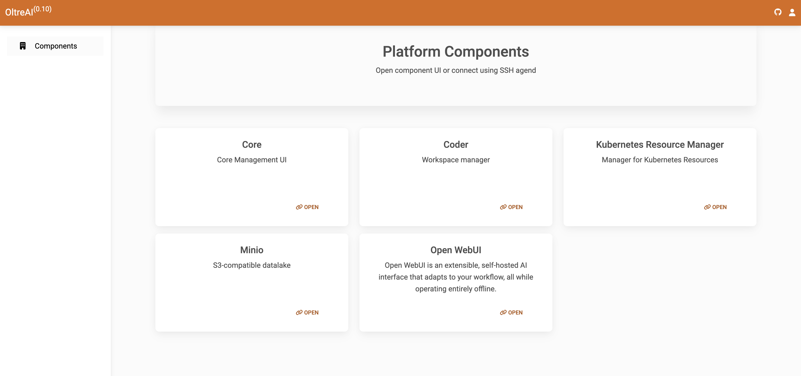

# DigitalHub Dashboard 
 [](https://github.com/scc-digitalhub/dh-dashboard/LICENSE) 


DigitalHub landing page application for component access. Static UI based on Vue SPA served with Nginx.



## Quick Start

To start the console locally, Node.JS is required.

Install dependencies with NPM:

```bash
npm install
```

Run the dashboard:
```bash
npm run dev
```

The dashboard is available at ``http://localhost:5173/``.


## Configuration

### Component Definition
File ``public/components.json`` defines the list of DH components that can be accessed with UI or port forwarding. Each component is defined with
- ``slug`` unique component ID managed by K8S
- ``name`` user-friendly component name
- ``description`` description of the component
- ``port`` defines TCP/HTTP port to perform port forwarding with SSH (optional).
- ``link`` defines the Web connection within coder domain management (optional).

### Monitoring Definition
File ``public/monitoring.json`` defines the list of Monitoring pages that can be accessed with UI or port forwarding. Each page is defined with
- ``slug`` unique dashboard ID
- ``name`` user-friendly dashboard name
- ``description`` description of the dashboard
- ``link`` defines the link to the dasboard.

### Authentication

It is possible to enable OIDC authentication for the dashboard component. Specifically, it is necessary to define the OIDC configuration (JSON) as of
[OIDC Client](https://authts.github.io/oidc-client-ts/) as environment variable ``VITE_OIDC_CONFIG``.

### Environment variables

It is possible to define the environment variables at the build time (``.env`` file notations) or at deployment time overwriting the file
``/public/env.js``. The supported variables are
- ``VITE_OIDC_CONFIG`` - OIDC configuration
- ``VITE_PLATFORM_TITLE``  - name of the platform
- ``VITE_PLATFORM_VERSION`` - version of the platform

## Development

The application is build with Vue.js framework. The dependencies are defined in ``package.json``.

## Build
To build Vue application, use the following steps (Node required):
- ``npm i`` to install the dependencies
- ``npm run build`` to build static resources

To build docker image, use the following steps:
- ``docker build -t <tag> .``
- ``docker run -d --name <container-name> -p 8080:8080 <tag>``

## Security Policy

The current release is the supported version. Security fixes are released together with all other fixes in each new release.

If you discover a security vulnerability in this project, please do not open a public issue.

Instead, report it privately by emailing us at [digitalhub@fbk.eu](mailto:digitalhub@fbk.eu). Include as much detail as possible to help us understand and address the issue quickly and responsibly.

## Contributing

To report a bug or request a feature, please first check the existing issues to avoid duplicates. If none exist, open a new issue with a clear title and a detailed description, including any steps to reproduce if it's a bug.

To contribute code, start by forking the repository. Clone your fork locally and create a new branch for your changes. Make sure your commits follow the [Conventional Commits v1.0](https://www.conventionalcommits.org/en/v1.0.0/) specification to keep history readable and consistent.

Once your changes are ready, push your branch to your fork and open a pull request against the main branch. Be sure to include a summary of what you changed and why. If your pull request addresses an issue, mention it in the description (e.g., “Closes #123”).

Please note that new contributors may be asked to sign a Contributor License Agreement (CLA) before their pull requests can be merged. This helps us ensure compliance with open source licensing standards.

We appreciate contributions and help in improving the project!

## Authors

This project is developed and maintained by **DSLab – Fondazione Bruno Kessler**, with contributions from the open source community. A complete list of contributors is available in the project’s commit history and pull requests.

For questions or inquiries, please contact: [digitalhub@fbk.eu](mailto:digitalhub@fbk.eu)

## Copyright and license

Copyright © 2025 DSLab – Fondazione Bruno Kessler and individual contributors.

This project is licensed under the Apache License, Version 2.0.
You may not use this file except in compliance with the License. Ownership of contributions remains with the original authors and is governed by the terms of the Apache 2.0 License, including the requirement to grant a license to the project.
